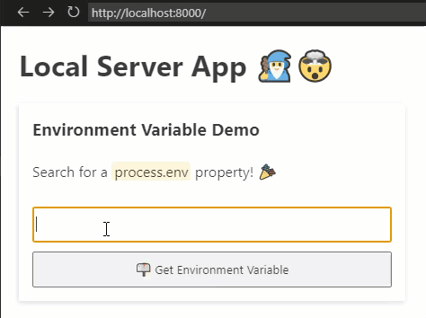

## Local Server App 🧙‍♂️🤯

This is a simple template for using your own browser as an app for your local machine. This is by creating a server and connecting it with [socket.io](https://socket.io/)!



## Why is this needed? 🙄

I needed to create an application at work using NodeJS, but couldn't install Electron. So, I thought it would be cool to make a server and do similar types of things.

A command line tool would have been cool too — but most of my users can't even interact with Excel 🙄 So a better UI was a must!

## Whats still needed? 🤔

- 🦺 Currently, it's more of a proof of concept — but, could really get cleaned up a bit and a bit more refined.
- 👏 Perhaps implement this with some type of framework? Svelte anyone?
- 🔓 Need a good way of opening the browswer when the script runs.

## How to get started 🏁

Clone this repo then run

```bash
npm install
```

For running in a test environment run

```bash
npm run dev
```

For creating an executable of the application run

```bash
npm run build
```

See [pkg](https://www.npmjs.com/package/pkg) for more instructions on how to customize target builds for this app. By default, this set to build for `win-x64`.